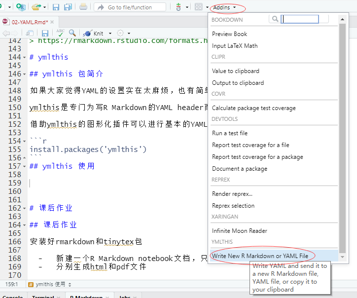
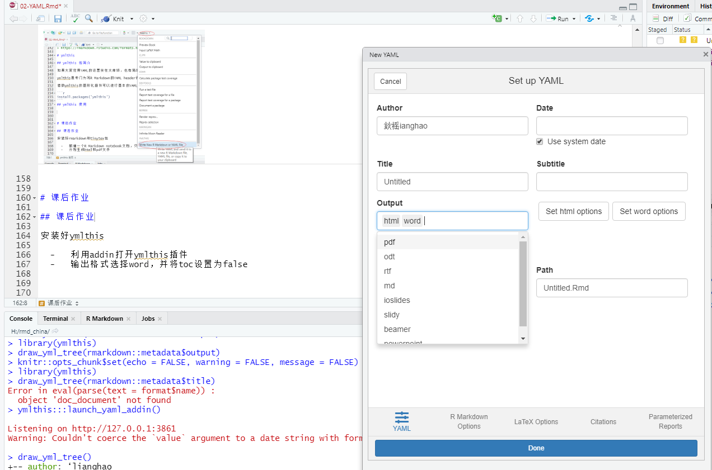

```{r setup, include=FALSE}
knitr::opts_chunk$set(echo = FALSE, warning = FALSE, message = FALSE)
```

# YAML是什么？

## YAML Ain’t Markup Language

YAML 的全称是“YAML Ain’t Markup Language”

YAML 是专门用来写配置文件的语言，简洁、强大，可以和JSON数据进行转换，成为文件元数据(metadata)

YAML 语言(发音 /ˈjæməl/)的设计目标，就是方便人类读写。它实质上是一种通用的数据串行化格式，几乎支持所有的主流编程语言

YAML 同样作为Rmd文档的metadata用来控制整个R Markdown 文件的配置，如输出格式/版权信息/日期/目录等

# YAML语法及格式

## 语法及注意事项

-   大小写敏感，在R一般都是小写
-   使用缩进表示层级关系
-   缩进时不允许使用Tab键，只允许使用空格。
-   缩进的空格数目不重要，只要相同层级的元素左侧对齐即可
-   键和值之间必须有空格(key: value)
-   布尔值: true/false, yes/no, on/off 和 TRUE/FALSE 等同(R)
    -   toc: true #toc为Table of Content(目录)的缩写
    -   toc: yes
    -   toc: on

## 数据结构

-   对象：键值对的集合(key: value)，又称为映射(mapping)/ 哈希(hashes)，如

``` yaml    
  toc: yes
```
    
-   数组：一组按次序排列的值，又称为序列(sequence) / 列表(list)，如

``` yaml
  author:
    - "梁昊"
    - "小咖"
    #或者
  author: ["梁昊","小咖"]
```
---

## 数据结构

-   组合(即以上两种的混合)，如

``` yaml
  author:
    - "梁昊"
    - "小咖" 
  powerpoint_presentation:
    toc: yes
    toc_depth: 1
```
> http://www.ruanyifeng.com/blog/2016/07/yaml.html


## YAML头部包裹

YAML heade通过```---```包裹metadata，放在Rmd文档的头部


```yaml
---
title: "02-YAML metadata" 
author: "小咖"
output:
 output: html_document
  toc: yes #显示目录
  toc_depth: 1 #显示目录级别
---
```
# YAML常用设定

## 题目、作者、日期

```yaml
title: "02-YAML metadata"
author: "梁昊"
date:  "`r format(Sys.time(), '%d %B, %Y')`"

# 配合rticles等包还可加入作者单位和通讯作者标注
author:
  - name: Hao Liang                              
    affiliation: Hunan University of Chinese Medicine    
    corresponding : yes
    email: "my@email.com"

```

## output

output主要对输出格式、目录、大纲级别、风格等进行设定

``` yaml    
output:
  powerpoint_presentation: #输出ppt
    reference_doc: ../00.Introduction/template.pptx #输出模板
    toc: yes #显示目录
    toc_depth: 1 #目录级别
    number_sections: no #目录是否标号
    slide_level: 2 #标题级别
```
不同的输出格式参数不同，详见

> https://rmarkdown.rstudio.com/formats.html

## 更多设定

YAML metadata for R Markdown with examples

https://github.com/hao203/rmarkdown-YAML


我对R Markdown 的YAML metadata 进行设置和掌握而创建的项目

未来打算：

1. 单独出教程
2. 邀请更多大牛加入


# ymlthis package

## ymlthis 包简介

如果大家觉得YAML的设置实在太麻烦，也有简单的方法，那就是用ymlthis

ymlthis是专门为写R Markdown的YAML header而开发的包

借助ymlthis的图形化插件可以进行基本的YAML设置

```r
install.packages('ymlthis')
```
## ymlthis addin调出



## ymlthis addin设置YAMLheader



# 课后作业

## 课后作业

安装好ymlthis

  -   利用addin打开ymlthis插件
  -   输出格式选择word，并将toc设置为false


