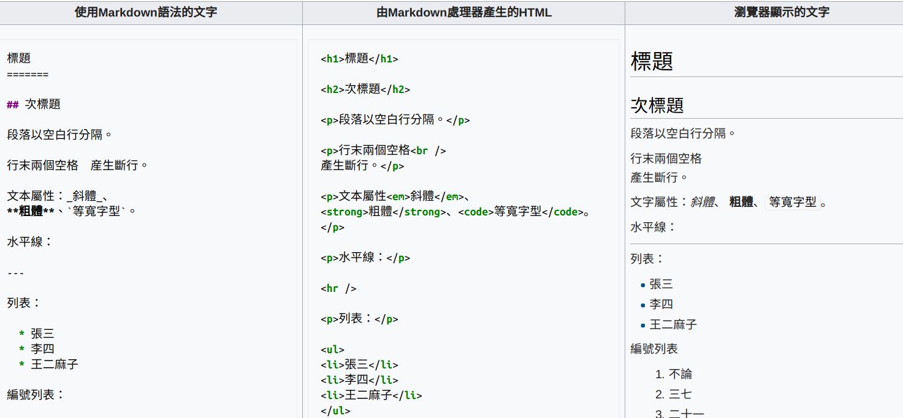
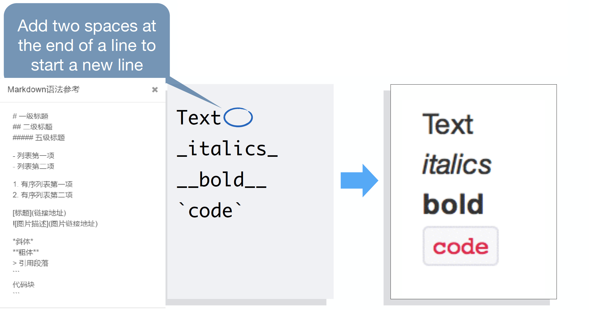
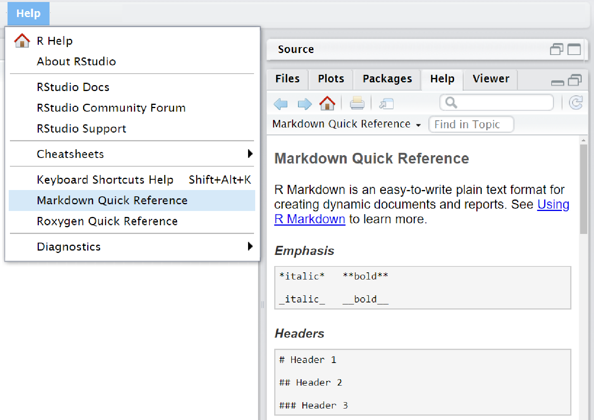

```{r setup, include=FALSE}
knitr::opts_chunk$set(echo = FALSE, warning = FALSE, message = FALSE)
library(tidyverse)
```

# Markdown

## Markdown是什么

Markdown是一种轻量级标记语言，它以纯文本形式(易读、易写、易更改)编写文档

Markdown非常容易上手，几分钟就可完成学习。排版精美，尤其适合学术写作

目前国内支持Markdown的网站

-   简书
-   印象笔记
-   CSDN
-   知乎
-   ...

<https://github.com/younghz/Markdown>

## Markdown一瞥



## 语法参考



## 数学公式

](images/equation.png)

## Markdown语法参考文档



# 代码块（Code Chunks）

## Code Chunks是R Markdown的灵魂

R Markdown的Code Chunks（代码块）是可以执行的，这就让数据分析可以在文档中执行，并按照自己的意愿进行控制

Chunks可以是R代码，也可以是其他语言，如Python

代码块```` ```{语言名称} ````开头，```` ``` ````结尾。

插入Chunk快捷键为Ctrl + Alt + I (OS X: Cmd + Option + I)

````md
```{r chunk-name} `r ''`
print ("a code chunk")
```
````

## Chunk和block的区别

Markdown代码块（code block）为纯文本，无法执行

````md
```r  
print("This will NOT be printed!")  
```  
````

Chunk，可以执行

````md
```{r} `r ''`
print("This will be printed!") 
```  
````

代码还有一种inline方式（行内执行）

````md
There are `r knitr::inline_expr('nrow(iris)')` observations in the **iris** dataset.
````

There are `r nrow(iris)` observations in the **iris** dataset.


## Chunk output options

```{r}
data.frame(
  Option = c(
  "eval",
  "echo",
  "include",
  "cache",
  "",
  "参数",
  "caption",
  "fig.cap"
),  
  Code = c(
  "输出结果？",
   "显示代码？",
   "输出代码和结果？",
   "保留缓存？避免重复执行",
   "",
   "FALSE/TRUE",
   "表格题注",
   "图片题注"
	)
) %>% 
  knitr::kable()
```


## 常用设定

```{r}
data.frame(
  Option = c(
  "Show output only",
  "Show code and output",
  "Show code (don't run code)",
  "Show nothing (run code)",
  "Show nothing (don't run code)",
  "",
  "Hide warnings",
  "Hide messages"
),  
  Code = c(
  "echo=FALSE",
   "echo=TRUE",
   "eval=FALSE",
   "include=FALSE",
   "include=FALSE, eval=FALSE",
   "",
   "warnings=FALSE",
   "messages=FALSE"
	)
) %>% 
  knitr::kable()
```

## Chunk默认设定

如果你的Rmd文档代码Chunk设定都基本一致，那可以在文档开头设定一个默认，后面的Chunks都会依照该设定


````
```{r default, include=FALSE} `r ''`
knitr::opts_chunk$set(echo = FALSE,
                      message = FALSE,
                      warning = FALSE)
```
````
## 插入其他语言Chunk

````
```{python} `r ''`
library(reticulate)
print("Hi,python")
import this
```
````
运行Python，需要安装 ‘reticulate’ ，并设置Python引擎(Tools--Global Options--Python)

# 课后作业

## 课后作业

新建一个R Markdown文档

-   创建一个代码块，并输入plot(cars)
-   只输出图片，不输出代码
-   图题为'cars plot'
-   输出文档为word