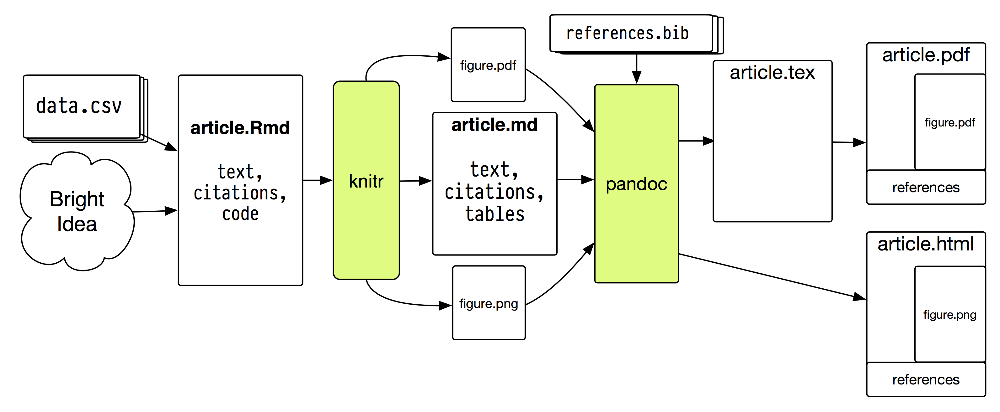

```{r setup, include=FALSE}
knitr::opts_chunk$set(echo = FALSE, warning = FALSE, message = FALSE)
library(tidyverse)
```
# 图片（Figures）

## 外部图片

直接用Markdown

````md
{width=50%}
````
{width=50%}

用Chunk

````md

```{r, out.width="50%", fig.cap="A nice image."} `r ''`

```

````

## 统计分析图（plot）

```{r cars-plot,out.width="70%", fig.dim=c(10, 4), fig.cap="cars scatter plot"}
plot(cars)
```

````md
```{r cars-plot,out.width="70%", fig.dim=c(10, 4), fig.cap="iris scatter plot"}`r ''`
plot(cars)
```
````

更多设置：https://yihui.org/knitr/options/#plots

# 表格（Table）

## Rmd表格简介

R Markdown的表格输出非常强大，可以根据需求使用不同的包实现

常见应用：

  -   输出Table One（baseline）基线数据
  -   输出数据的基本特征（Descriptive Statistics ）
  -   回归数据的结果（OR,95%CI等）
  -   表格中还可以加入多种曲线

{width=80%}

## 表格常用的R包

```{r}
data.frame(
  名称 = c(
  "gtsummary",
  "modelsummary",
  "tableone",
  "stargazer",
  "sjPlot",
  "texreg"
),  
  简介 = c(
  "优雅输出论文发表的基线数据和回归数据",
  "为统计模型输出图表",
   "为生物医学研究输出Table 1",
   "输出表格回归数据和Descriptive Statistics",
   "为社会科学回归模型转化图表",
   "回归数据转化为表格"
	),
 格式 = c(
  "HTML/PDF/Word",
  "HTML/PDF/Word",
   "/",
   "HTML/PDF/Word",
   "HTML",
   "HTML/PDF/Word"
	)

) %>% 
  knitr::kable(caption = "表格R包汇总")
```

# 管道操作（ %>% ）

## 常规代码的反人类设计

常规的代码，是如何书写函数的？

1. 取10000个随机数符合，符合正态分布。
2. 求这个10000个数的绝对值，同时乘以50。
3. 把结果组成一个100*100列的方阵。
4. 计算方阵中每行的均值，并四舍五入保留到整数。
5. 把结果除以7求余数，并话出余数的直方图。

参考：http://blog.fens.me/r-magrittr/

## 源代码展示

```{r echo=TRUE, eval=FALSE}
#方案一：创建额外的辅助变量实现
set.seed(1) # 设置随机种子
n1<-rnorm(10000)            # 第1步
n2<-abs(n1)*50              # 第2步
n3<-matrix(n2,ncol = 100)   # 第3步
n4<-round(rowMeans(n3))     # 第4步
hist(n4%%7)                 # 第5步

#方案二：用()反复嵌套
set.seed(1)
hist(round(rowMeans(matrix(abs(rnorm(10000))*50,ncol=100)))%%7)

```

## magrittr %>% 

管道操作（pipe）是R特有的函数表达方式

管道操作 %>% 依赖magrittr，快捷键“Ctrl+Shift+M”

让代码更易读，避免中间变量和反复嵌套，如

```{r echo=TRUE, eval=FALSE}
 rnorm(10000) %>%
   abs %>% `*` (50)  %>%
   matrix(ncol=100)  %>%
   rowMeans %>% round %>% 
   `%%`(7) %>% hist
```

# Table One

## 自动化Table 1

Table 1 是医学领域最常见的表格

其他领域，Descriptive Statistics和回归结果也颇为常见

gtsummary是Table 1 的首选

gtsummary支持kableExtra和flextable，flextable支持度最好

```{r echo=TRUE}
# 加载必要的包
pacman::p_load(gtsummary, kableExtra, flextable, readr, magrittr)
```

## Example

```{r }
baseline <- read_csv("baseline.csv") 
baseline[] <- lapply(baseline, as.character) 
baseline1 <- baseline %>% select(AgeGroup,Gender,Metastasis,Event)
  
tbl_summary(
  baseline1,
  by = Event,
          ) %>% 
  add_n() %>% 
  add_p() %>% 
  bold_labels() %>% 
  as_flex_table() %>% 
  set_caption(caption= "Table One gtsummary自动生成")

```

# 课后作业

## 课后作业

新建一个R Markdown文档

-   创建一个代码块，并输入plot(cars)
-   给该图加入caption（题注）
-   读取数据baseline.csv，并转化成character
-   选取AgeGroup,Gender,Venous-differentiation,Event字段，并通过gtsummary输出表格
