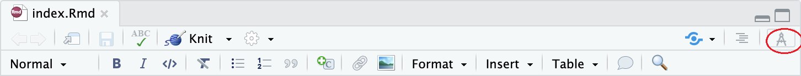
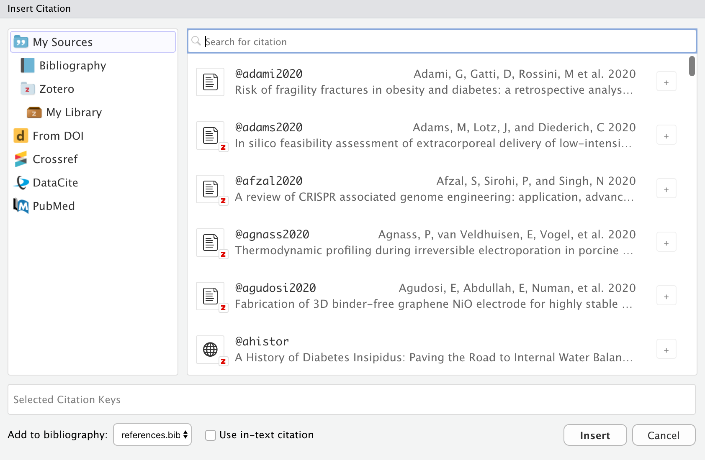

```{r setup, include=FALSE}
knitr::opts_chunk$set(echo = FALSE, warning = FALSE, message = FALSE)

```

# 参考文献

## 基本设定

参考文献是学术写作必备的模块

任何参考文献管理工具，操作流程都是四个步骤

-   **建库-导入文献-插入文献-设定style**

YAML header首先要设定好库和style

``` {.yaml}
bibliography: ref.bib #设定库
bibliography: [book.bib, journal.bib] #库也可以设置多个
csl: nature.csl #设定style
```

## .bib文件

.bib是用来存储文献的标准库文件，依照LaTeX格式（BibTeX）存储了文献的信息，如

``` {.bibtex}
@Book{ggplot2,
    author = {Hadley Wickham},
    title = {ggplot2: Elegant Graphics for Data Analysis},
    publisher = {Springer-Verlag New York},
    year = {2016},
    isbn = {978-3-319-24277-4},
    url = {http://ggplot2.org},
  }
```

几乎所有的学术期刊和学术搜索引擎（谷歌学术/百度学术）都支持.bib

## 如何管理.bib

很显然，直接查看.bib文件是很不明智的，需要有文献管理软件来对.bib进行管理

主流的参考文献管理软件都支持.bib

-   **Zotero**
-   **Jabref**
-   Paperpile
-   Mendeley
-   EndNote

我更加推崇`Zotero`和`Jabref`，开源、免费，支持多平台

## style设定（CSL）

CSL (Citation Style Language)是一种通用的设定style的语言

我们可以在[Zotero Style Repository](https://www.zotero.org/styles)找到自己需要的style

这个库拥有最全的style（截止目前10057）

如果找不到自己需要的，还可以https://editor.citationstyles.org自己编辑

## 插入引用

每个参考文献在.bib库中都有一个BibTex key，这个key是唯一的，用来插入引用

``` {.bibtex}
@Book{ggplot2,
    author = {Hadley Wickham},
    title = {ggplot2: Elegant Graphics for Data Analysis},
    publisher = {Springer-Verlag New York},
    year = {2016},
    isbn = {978-3-319-24277-4},
  }
```

ggplot2为BibTex key，想要插入这条文献，只需输入`[@ggplot2]`，[@ggplot2]

多条文献，输入`[@Shaul2019; @Hurt2017; @Mukaida2020]`，[@Shaul2019; @Hurt2017; @Mukaida2020]

## 参考文献放置位置 {#参考文献放置位置}

我们引用的参考文献，肯定要放在文档中

-   默认情况下，R Markdown的参考文献放于最后

如果你想把参考文献放置在其他地方，就需要单独声明

-   `<div id="refs"></div>`


[参考文献位置][参考文献列表放这里]
    

# 交叉引用 {#example-section}

## 交叉引用的方法

如果想引用文档内的图、表、章节等，可以采用交叉引用（Cross-referencing）

引用方法：

-   `\@ref(fig:chunk-name)` \#引用图片
-   `\@ref(tab:chunk-name)` \#引用表格
-   `\@ref(label)` \#引用章节

> 该方法只适用于bookdown输出（图表引用），在应用前，请安装bookdown包

## 交叉引用举例-图表

YAML设定

``` {.yaml}
bookdown::pdf_document2: default
```

cars数据集散点图 \@ref(fig:cars-plot)

`{r cars-plot, fig.cap="The cars data."}`

```{r cars-plot, fig.cap="The cars data."}
plot(cars)
```

## 交叉引用具体-章节

方法一：`[文字][章节名称]` --- [参考文献放置位置](#参考文献放置位置)

方法二：引用章节（位置），后面加入ID，即`{#id}` --- `[link text](#ID)`

我们在**\# 交叉引用** 这章后面加ID`{#example-section}`

-   `# 交叉引用 {#example-section}`
-   [交叉引用](#example-section)

# Rstudio 1.4新特性

## Rstudio 1.4升级可视化编辑



这样即使你不懂Markdown，不懂基本的语法，也能像普通编辑器一样编辑.Rmd文件了

参考：<https://rstudio.github.io/visual-markdown-editing>

## 强大的参考文献管理



除管理.bib外，还可以和Zotero配合，甚至直接从pubmed导入文献

# 参考列表

## 参考文献列表放这里

<div id="refs"></div>

# 课后作业

## 课后作业

新建一个R Markdown文档

-   创建一个.bib文件,加入一些文献
-   设置style为lancet
-   在正文中插入引文
-   输出为word
